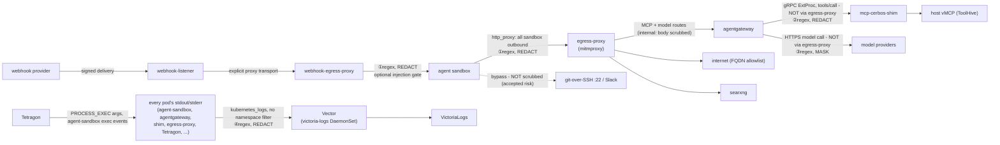

# Secret & PII redaction

Where credential-shaped strings and PII get scrubbed on this platform, in code and in the network flow. This is the definitive reference for "does X leg redact, and against what patterns."

## Why four enforcement points

There is no single central scrubber because there is no single pipe to tap. Three genuinely different processes make outbound calls that carry agent-controlled content, and each call leaves from a different place; a fourth point covers log ingestion, which carries agent-controlled content by a completely different mechanism (stdout, not a network call) and would otherwise bypass all three of the others entirely:

- **The agent sandbox and webhook listener** originate different HTTP paths. Sandbox calls are forced through the shared `egress-proxy` by proxy environment variables. Authenticated webhook deliveries use an explicitly pinned transport to the dedicated `webhook-egress-proxy`. Both deployments execute the same rendered scrubber, while Cilium keeps their clients and destinations disjoint.
- **agentgateway** makes a gRPC ExtProc call to `mcp-cerbos-shim` for every `tools/call` (the guardrail). This call originates from agentgateway, so it never touches the egress-proxy.
- **agentgateway** makes its own HTTPS call to the model provider (Anthropic/OpenAI). Also from agentgateway, also never through the egress-proxy.
- **Every pod** writes stdout/stderr, which Vector (the `victoria-logs` chart's log agent, a cluster-wide DaemonSet) scrapes unconditionally via a `kubernetes_logs` source with no namespace/pod filter. This is the one leg that isn't a network call at all - Tetragon's `PROCESS_EXEC` events (full command-line arguments for every process executed in `agent-sandbox`) land here via Tetragon's own stdout, and any component that logs a secret-shaped string at any log level lands here too.

The two agentgateway legs are provably disjoint from the sandbox's egress path: the gateway's egress policy (`charts/platform/templates/gateway-egress-networkpolicy.yaml`) allows it to reach the model providers directly (`toEntities: [world]` on 443) and the shim directly (cerbos namespace, 4445), with no hop through the egress-proxy; and its ingress policy (`charts/platform/templates/gateway-networkpolicy.yaml`) accepts the egress-proxy and the shim as two *separate*, independently-allowed sources. A scrubber sitting on the sandbox's egress path structurally cannot see either agentgateway-originated call, no matter how it is configured - so each leg carries its own enforcement point.

## The four enforcement points

### 1. egress-proxy (mitmproxy, Python)

- **Covers:** all outbound HTTP(S) the agent sandbox itself makes through the ordinary proxy, plus authenticated listener-to-agent webhook deliveries through the dedicated proxy.
- **Catches:** the regex registry (`REDACT_PATTERNS` in `charts/egress-proxy/templates/addon-configmap.yaml`) - the 35 secret shapes plus the SSN/card/phone PII regexes. The patterns are not hand-written into the ConfigMap: they are compiled at render time from the canonical `images/mcp-cerbos-shim/internal/server/secret-patterns.json`, injected by the installer/validator via `helm --set-file secretPatterns=…`. Each match is replaced with `<masked>`.
- **Where the patterns live:** the canonical `secret-patterns.json`; `REDACT_PATTERNS` in `addon-configmap.yaml` is compiled from it at render time.
- **Action:** redact-and-forward. A matched secret/PII pattern is *never* a block - it is replaced with `<masked>` and the request/response proceeds. The proxy's 403s are for policy, not pattern matches: SSRF (private-address destination), non-GET/HEAD method to an external host, URL over 2048 chars, a body on a GET/HEAD, a WebSocket upgrade, an FQDN not on the allowlist, or a path outside that host's `EXTERNAL_PATH_SCOPES` entry.
- **What is external-only:** the SSRF block, URL-length limit, GET/HEAD-body block, method enforcement, FQDN allowlist, and path-scope check all apply only to external destinations. Hosts ending in `.cluster.local`/`.svc` (agentgateway, searxng) are classified internal and skip those. **Every scrub, by contrast, runs on internal traffic too** - the URL path/query, the `Authorization`/`Basic`/`x-api-key` headers, all other headers, and the body are redacted on every destination, so the sandbox→agentgateway leg is scrubbed here as well as at the shim. That includes an agent-supplied auth header on an MCP or model call: agentgateway injects the real upstream provider key on its own outbound leg, so an `Authorization` value arriving from the sandbox is only ever a secret to mask.
- **Known limits:** pattern-based only - no encoded-form detection (base64, hex, rot13), no Luhn check on card numbers, space/dash-grouped cards not matched. The FQDN allowlist is the primary external control, not this scrub. Streaming responses (SSE / `Transfer-Encoding: chunked`) are skipped to avoid buffering. git-over-SSH (port 22) and Slack bypass the proxy entirely and are not scrubbed (accepted risk, documented in `scrub.py`).

The dedicated webhook proxy can additionally run prompt-injection detection after redaction when `policy.contentSafety.promptInjection.status` is `enabled`. Its stage-one registry comes from `images/mcp-cerbos-shim/internal/promptinjection/patterns.json`, the same JSON embedded by the shim. Only regex matches reach the Agentgateway judge; confirmed injections and verification-budget exhaustion return 403, while judge-service errors fail open. This gate is independent of secret matching: secret matches are still redacted and forwarded.

### 2. mcp-cerbos-shim (Go, agentgateway ExtProc guardrail)

- **Covers:** every MCP `tools/call` argument (`CheckRequest`, before the call reaches the host vMCP) and every tool result (`CheckResponse`, before the result reaches the model), regardless of which backend the tool lives on. This is the one place that sees every tool call in both directions. `resources/read`, `prompts/get`, and asynchronous `tasks/get` results are also covered on the response leg - none has a Cerbos mapping from which to build an authorizable resource, so their response bodies pass through the shim for prompt-injection detection and secret redaction. `tasks/cancel` is explicitly `Off`: task creation was authorized at the originating `tools/call`, and cancellation carries no new resource the shim can map; agentgateway's task RBAC still applies.
- **Catches:** the regex registry `secretPatternRegistry` (`images/mcp-cerbos-shim/internal/server/secrets_redact.go`), embedded from the canonical `secret-patterns.json` via `//go:embed` - the same file the egress-proxy renders from, so the two legs never drift. Walks JSON recursively, including secrets one level of JSON-string-encoding deep (e.g. Jira's raw `additional_fields`).
- **Where the patterns live:** the canonical `secret-patterns.json`, embedded into `secretPatternRegistry` (`secrets_redact.go`) at build time.
- **Action:** redact-and-forward (mutate, never deny). Redaction is just another argument rewrite, applied after Cerbos allows - the same `mutate()` path used for GitHub's forced-draft override. A matched pattern never turns into a Cerbos denial; the deny-by-resource guardrail (project/team/repo scoping) is a separate control.
- **Why it exists independently:** it is wired in by `charts/platform/templates/vmcp.yaml` as a `remote.backendRef` guardrail processor on `tools/call` (`failureMode: FailClosed`). agentgateway's call to it is a direct gRPC hop (cerbos namespace, 4445) that never transits the egress-proxy - so it is the *only* scrubber on the leg carrying tool results back toward the model.
- **Known limits:** same pattern-only caveats as the egress-proxy (no encoded forms, no Luhn, grouped cards missed).

### 3. agentgateway AIPromptGuard (Rust regex, native CRD field)

- **Covers:** the model-facing request and response bodies on every AI backend - `anthropic`, `openai`, `deepseek`, `zai`, and the `mnemosyne-anthropic` shim (`charts/platform/templates/models/*.yaml`). This is agentgateway's own HTTPS call to the provider, which never transits the egress-proxy.
- **Catches:** all 41 canonical patterns (35 secret shapes plus the SSN/card/phone PII regexes) on model requests and the 33 high-confidence credential patterns on model responses. Both lists come from the same `secret-patterns.json`, injected at render time via `helm --set-file secretPatterns=…`, exactly like the egress-proxy leg. Custom regexes are used instead of agentgateway's native `builtins: [Ssn, CreditCard, PhoneNumber]`: the built-in detectors carry an unscored bare `\b[0-9]{9}\b` that masks ordinary 9-digit numeric content.
- **Where the patterns live:** the canonical `secret-patterns.json`, rendered into the `promptGuard.request[].regex.matches` / `.response[].regex.matches` lists by `charts/platform/templates/_promptguard.tpl` (the shared partial `include`d by each AI backend) via `fromJsonArray`; the partial's `required` + empty-list `fail` guards make a render that forgets `--set-file` fail closed rather than ship an empty guard.
- **Action:** all 41 patterns mask matching request content before forwarding. Buffered or streaming model responses use `Reject`, because v1.4.1 cannot safely mutate streamed response chunks, but only for the 33 high-confidence credential patterns. Generic HTTP authentication wrappers and PII shapes are request-only: request masking prevents the provider from seeing or echoing those inbound values, while response rejection on ordinary authentication prose, generated phone numbers, and synthetic test fixtures caused frequent false 403s. A provider can still independently generate content matching one of those eight request-only shapes; that output is accepted as the deliberate false-positive tradeoff. The default rejection body is the static text `The request was rejected due to inappropriate content`; it does not echo matched content. The v1.4.1 runtime supports custom rejection bodies internally, but its Kubernetes CRD does not declare the `rejection` field, so chart-managed backends must use the default.
- **Known limits / caveats:** regex-only, with the same pattern caveats as the other legs. Streaming evaluation is windowed: agentgateway holds roughly 1 KiB at a time with 256 bytes of overlap, so content from earlier clean windows may already have reached the client when a later match terminates the stream, and patterns spanning more than the overlap can be missed. This closes the demonstrated token leak but is not equivalent to full-response buffering.

The exact 403 body above is therefore a gateway guard signature, not evidence that the provider rejected the prompt or that the caller needs to authenticate again. Retry only after removing the matched synthetic fixture from model-visible context; construct the complete secret-shaped fixture deterministically at runtime rather than weakening the response guard. A more specific HTTP body requires an agentgateway CRD version that declares `promptGuard.response[].rejection`; v1.4.1's runtime implementation alone is not enough because Kubernetes rejects undeclared chart fields.

### 4. victoria-logs Vector agent (VRL remap, cluster-wide DaemonSet)

- **Covers:** every pod's stdout/stderr cluster-wide, ingested by Vector's `kubernetes_logs` source with no namespace/pod filter (`stages/values/victoria-logs.yaml`). This is not a network call the other three legs could ever see - it's log scraping, a structurally different mechanism. Notably this is what carries Tetragon's `PROCESS_EXEC` events (full command-line arguments for every process executed in `agent-sandbox`) into VictoriaLogs, since Tetragon's own stdout is one of the pods Vector scrapes.
- **Catches:** the same 41 canonical patterns as the other legs (`redactor` transform in `stages/values/victoria-logs.yaml`), ported to VRL/Rust-regex-crate syntax. Runs after the `parser` transform that flattens Tetragon's JSON event shape into `.message`, so exec arguments are redacted before the sink ships them. VRL cannot build a regex from a runtime string, so this leg cannot inject the JSON at render time like legs 1 and 3 - instead its statements are **generated** from the canonical JSON by `scripts/gen-vector-redactor.py` and committed between sentinel comments, with `validate.sh` running the generator in `--check` mode to fail closed on any drift.
- **Where the patterns live:** the `redactor` transform's `source:` block in `stages/values/victoria-logs.yaml`, generated from the canonical `secret-patterns.json` by `scripts/gen-vector-redactor.py` (drift-guarded in `validate.sh`).
- **Action:** redact-and-forward, like egress-proxy and the shim - a match replaces the substring with `<masked>` in `.message` and the (now-redacted) log line still ships to VictoriaLogs. There is no reject/drop path for logs; the point is to scrub before retention, not to block observability.
- **Known limits:** regex-only, no encoded-form detection - same caveats as the other legs. Only `.message` is redacted; other structured fields Vector attaches (`kubernetes.*` labels, `log.*` sub-fields left over from the JSON parse) are not scanned, so a secret that lands in a *label* rather than the message body would still slip through. VictoriaLogs retains 7 days (`server.retentionPeriod`) - anything this leg misses persists in queryable form for that window.

## Flow

```mermaid
flowchart LR
    PROVIDER[webhook provider]
    WL[webhook-listener]
    WEP[webhook-egress-proxy]
    H[agent sandbox]
    EP["egress-proxy<br/>(mitmproxy)"]
    AGW[agentgateway]
    SHIM[mcp-cerbos-shim]
    VMCP["host vMCP (ToolHive)"]
    LLM["model providers"]
    NET["internet (FQDN allowlist)"]
    SX[searxng]
    DIRECT["git-over-SSH :22 / Slack"]
    TETRA[Tetragon]
    ALLPODS["every pod's stdout/stderr<br/>(agent-sandbox, agentgateway,<br/>shim, egress-proxy, Tetragon, ...)"]
    VECTOR["Vector<br/>(victoria-logs DaemonSet)"]
    VLOGS[VictoriaLogs]

    PROVIDER -->|"signed delivery"| WL
    WL -->|"explicit proxy transport"| WEP
    WEP -->|"①regex, REDACT<br/>optional injection gate"| H
    H -->|"http_proxy: all sandbox outbound<br/>①regex, REDACT"| EP
    EP -->|"MCP + model routes (internal: body scrubbed)"| AGW
    EP --> NET
    EP --> SX
    AGW -->|"gRPC ExtProc, tools/call - NOT via egress-proxy<br/>②regex, REDACT"| SHIM
    SHIM --> VMCP
    AGW -->|"HTTPS model call - NOT via egress-proxy<br/>③regex, MASK"| LLM
    H -.->|"bypass - NOT scrubbed (accepted risk)"| DIRECT
    TETRA -->|"PROCESS_EXEC args, agent-sandbox exec events"| ALLPODS
    ALLPODS -->|"kubernetes_logs, no namespace filter<br/>④regex, REDACT"| VECTOR
    VECTOR --> VLOGS
```

Each HTTP, webhook, MCP, model, and logging arrow is labelled with its enforcement point. The two agentgateway-originated arrows (② and ③) are explicitly marked "NOT via egress-proxy" because the egress-proxy cannot see those disjoint legs. The listener path uses a dedicated instance of the same ① scrubber before the request reaches the sandbox. The dotted arrow (git-over-SSH, Slack) bypasses all HTTP scrubbing by design; this bypass is scoped to the network traffic. A secret in a git-over-SSH or Slack-bound command's arguments is still executed inside the sandbox and therefore passes through Tetragon → ④, even though the network call itself never touches the egress-proxy.

## Pattern parity

All four legs derive from the same 41-pattern registry. The agentgateway request guard carries all 41; its response guard intentionally carries only the 33 high-confidence credential patterns.

| Pattern | egress-proxy | mcp-cerbos-shim | agentgateway request / response | victoria-logs Vector |
| --- | :---: | :---: | :---: | :---: |
| SSH private key | ✅ | ✅ | ✅ | ✅ |
| Slack `xox*` token | ✅ | ✅ | ✅ | ✅ |
| Slack `xapp-*` token | ✅ | ✅ | ✅ | ✅ |
| `Bearer` value | ✅ | ✅ | ✅ / ❌ | ✅ |
| `Basic` value | ✅ | ✅ | ✅ / ❌ | ✅ |
| AWS access key ID | ✅ | ✅ | ✅ | ✅ |
| GitHub token | ✅ | ✅ | ✅ | ✅ |
| GitLab token | ✅ | ✅ | ✅ | ✅ |
| Google API key | ✅ | ✅ | ✅ | ✅ |
| OpenAI key | ✅ | ✅ | ✅ | ✅ |
| Anthropic key | ✅ | ✅ | ✅ | ✅ |
| Stripe key | ✅ | ✅ | ✅ | ✅ |
| Notion token | ✅ | ✅ | ✅ | ✅ |
| Twilio SID | ✅ | ✅ | ✅ | ✅ |
| npm token | ✅ | ✅ | ✅ | ✅ |
| Generic JWT | ✅ | ✅ | ✅ | ✅ |
| Okta API token | ✅ | ✅ | ✅ | ✅ |
| Atlassian API token | ✅ | ✅ | ✅ | ✅ |
| Atlassian scoped token | ✅ | ✅ | ✅ | ✅ |
| Databricks PAT | ✅ | ✅ | ✅ | ✅ |
| Azure Storage account key | ✅ | ✅ | ✅ | ✅ |
| Azure Entra client secret | ✅ | ✅ | ✅ | ✅ |
| Elastic `ApiKey` header | ✅ | ✅ | ✅ | ✅ |
| DB/broker URI inline password | ✅ | ✅ | ✅ | ✅ |
| GitHub fine-grained PAT | ✅ | ✅ | ✅ | ✅ |
| JFrog API key | ✅ | ✅ | ✅ | ✅ |
| JFrog reference token | ✅ | ✅ | ✅ | ✅ |
| Grafana service account token | ✅ | ✅ | ✅ | ✅ |
| Grafana Cloud access policy token | ✅ | ✅ | ✅ | ✅ |
| Docker Hub PAT | ✅ | ✅ | ✅ | ✅ |
| PyPI upload token | ✅ | ✅ | ✅ | ✅ |
| HuggingFace token | ✅ | ✅ | ✅ | ✅ |
| 1Password service account token | ✅ | ✅ | ✅ | ✅ |
| Linear API key | ✅ | ✅ | ✅ | ✅ |
| PagerDuty `Token token=` header | ✅ | ✅ | ✅ | ✅ |
| US SSN | ✅ regex | ✅ regex | ✅ / ❌ | ✅ regex |
| Credit card (Visa/MC/Amex/Discover) | ✅ 4 regexes | ✅ 4 regexes | ✅ / ❌ | ✅ 4 regexes |
| US phone | ✅ regex | ✅ regex | ✅ / ❌ | ✅ regex |
| Email | ❌ excluded | ❌ excluded | ❌ excluded | ❌ excluded |
| Action on match | redact | redact | mask / reject | redact |

In the agentgateway column, a single ✅ means ✅ / ✅; only the eight request-only rows are shown as ✅ / ❌.

Every leg is regex-only and derives from the same 41 canonical patterns (35 secret + 6 PII regexes); agentgateway requests use all 41 while responses use the 33 entries not marked request-only. Agentgateway does not use its PII builtins. A separate asymmetry remains on the Vector leg: only `.message` is scrubbed, so a secret landing in a structured field Vector attaches separately (`kubernetes.*` labels, etc.) would not be caught even though all 41 patterns run against the log body.

## The canonical JSON: one source, four legs

The pattern set has **one source of truth** - `images/mcp-cerbos-shim/internal/server/secret-patterns.json`, an array of 41 objects with `name` and `regex`, plus optional `modelResponse: false` metadata for request-only prompt-guard entries (35 secret shapes + 6 PII regexes). Every one of the four legs derives from it; none is hand-mirrored. Each leg uses the strongest centralization its config surface allows:

1. `images/mcp-cerbos-shim/internal/server/secrets_redact.go` - `secretPatternRegistry` (Go, RE2), embedded via `//go:embed secret-patterns.json` at build time.
2. `charts/egress-proxy/templates/addon-configmap.yaml` - `REDACT_PATTERNS` (Python, `re`), injected at render time via `helm --set-file secretPatterns=<that file>`.
3. `charts/platform/templates/_promptguard.tpl` - the `promptGuard` `matches` lists (agentgateway, Rust regex crate), the shared partial `include`d by every model backend under `charts/platform/templates/models/`, injected at render time via the same `helm --set-file` and decoded with `fromJsonArray`.
4. `stages/values/victoria-logs.yaml` - the `redactor` transform's `source:` block (Vector VRL, Rust regex crate). VRL cannot build a regex from a runtime string, so there is no `--set-file`/embed seam here; instead the block is **generated** from the JSON by `scripts/gen-vector-redactor.py` and committed between sentinel comments.

Legs 1–3 pick up a JSON change automatically at build/render time; legs 2 and 3 are `required`-guarded, so a render that forgets `--set-file` fails closed rather than shipping an empty pattern set. Leg 4 is the only one that carries a committed copy, and it is regenerated (not hand-edited) and drift-guarded: `scripts/validate.sh` runs `gen-vector-redactor.py --check` and fails the build if the committed block no longer matches the JSON.

So **adding or changing a pattern means editing the canonical JSON and running `python3 scripts/gen-vector-redactor.py` to regenerate leg 4** (CI fails closed if you forget); legs 1–3 need no further action. Keep every pattern RE2-compatible (no lookaround, no backreferences) so the same literal ports across all three regex dialects (Go RE2, Python `re`, Rust regex crate used by both legs 3 and 4), with `(?i)` inline where case-insensitivity is needed.

## Why Email is excluded everywhere

None of the four legs match email addresses, deliberately. Email addresses are load-bearing in legitimate agent traffic - most concretely, Jira ticket assignment is done *by email address*, so scrubbing or rejecting on an email match would break a normal, authorized workflow. There is simply no email pattern in the canonical `secret-patterns.json`, so every leg omits it by construction. (agentgateway's native PII builtins do offer an `Email` option, but this platform doesn't use those builtins at all - all PII is matched by the canonical regexes.) Do not "helpfully" re-add an email pattern to the JSON.
